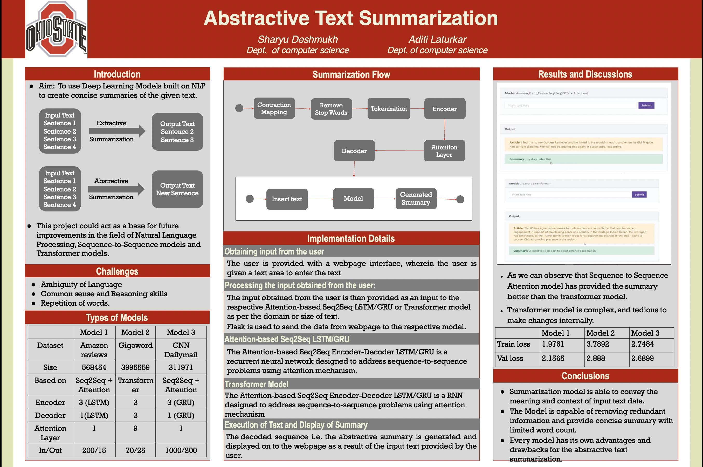
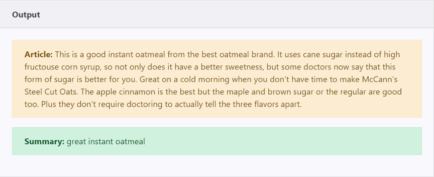
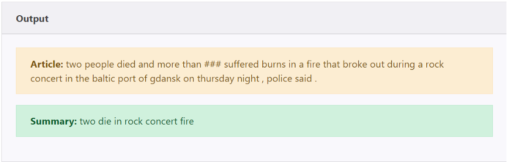

# Abstractive-Summarization

## Introduction
This project aims to deliver concise summaries of provided text through the utilization of NLP-based Deep Learning Models. The intended beneficiaries encompass individuals such as teachers, students, scientists, and others pressed for time, seeking a quick understanding of extensive textual content. Furthermore, the project holds potential utility in constructing summary engines or websites, offering users the ability to obtain summaries for various types of text. Additionally, it serves as a foundational initiative, contributing to advancements in Natural Language Processing, Sequence-to-Sequence models, and Transformer models.

## Methodology

### User Input Acquisition:
Users interact with a web interface, presenting a webpage featuring a text area for input.

### Input Processing:
The user-inputted text is sent to the relevant model—Attention-based Seq2Seq LSTM/GRU or Transformer—based on text size or domain. Flask, a Python micro web framework, facilitates data transfer from the webpage to the Python script for processing.

### Attention-based Seq2Seq LSTM/GRU:
Employing a recurrent neural network architecture, specifically Attention-based Seq2Seq Encoder-Decoder LSTM/GRU, this model addresses sequence-to-sequence challenges using an attention mechanism. Training involves input tokens for encoding and target tokens for decoding. The model processes data from text files containing articles and corresponding summaries. The trained model decodes user input, generating a readable summary.

### Transformer Model:
The Transformer model, a transduction model reliant on attention mechanisms, replaces traditional recurrent layers with multi-headed self-attention layers. This design allows for enhanced parallelization, resulting in faster training compared to recurrent or convolution-based architectures.

### Summary Generation and Display:
The decoded sequence, representing the abstractive summary, is generated based on user input. This summary is then displayed on the webpage, offering users a concise representation of the provided text.

## Result

